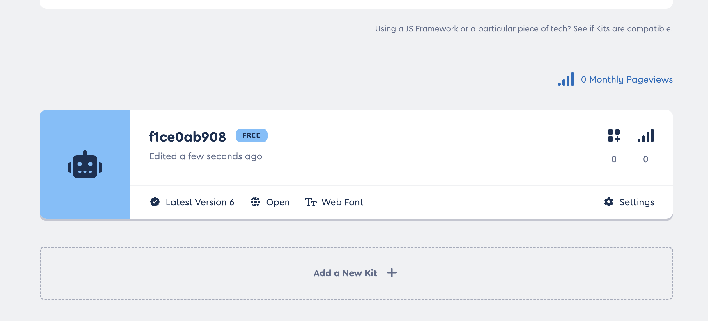

# Design (Optional)

OK, this is great. We have the ability to save the state of the checkboxes in local storage. But the checkboxes look, terrible..... Let's fix that.

Note: this step is optional. If you are happy with the checkboxes, you can skip this step.  This step is cool though so.......

Take a look at the icons on the bulma [documentation](https://versions.bulma.io/0.9.4/documentation/elements/icon/).

To use an icon, we are going to sign up to font awesome and get an icon. You can sign up [here](https://fontawesome.com/start).


Enter your email address and get started.  If you are asked what you are using access for, select "Personal" or "Student".

It is possible to skip adding your personal information apart from your email address.

Now click "Add New Kit".


At times, it automatically creates the kit for you so scroll down:



Click on this kit and copy the script tag:


Put this in your layout.njk just before `bulma.js` declaration.

This link is personal to you, you shouldn't use the one in the image as it may stop working at any time.

Also be sure that you have version 6 in your kit.

Right, now search for the heart icon `https://fontawesome.com/search?q=heart&o=r&m=free` and click on it.


Let's now add this icon in place of our checkbox. Open `js/components/playlist-item.js` and replace the checkbox with the following code:

```javascript
window.dotify.components.createPlaylistItem = (playlist) => {
  return `
  <div class="column is-4">
    <section class="card has-text-centered">
      <header class="card-header">
        <p class="card-header-title is-centered">
          ${playlist.name}
        </p>
        <button id="fave-${playlist.name}" class="card-header-icon">
          <span class="icon">
            <i class="fa-regular fa-heart"></i>
          </span>
        </button>
      </header>
      <div class="card-image">
        <figure class="image">
          
        </figure>
      </div>
      <article class="card-content">
        <p class="content is-size-4">
          ${playlist.description}
        </p>
      </article>
      <footer class="card-footer">
        <a class="card-footer-item button has-background-grey-lighter">Play</a>
        <a href="/playlist/?name=${playlist.name}" class="card-footer-item button has-background-grey-lighter">Open</a>
        <a class="card-footer-item button has-background-grey-lighter">Remove</a>
      </footer>
    </section>
  </div>`
}
```

Note the header.

```html
 <header class="card-header">
  <p class="card-header-title is-centered">
    ${playlist.name}
  </p>
  <button id="fave-${playlist.name}" class="card-header-icon">
    <span class="icon">
      <i class="fa-regular fa-heart"></i>
    </span>
  </button>
</header>
```

We now have a button with a heart icon. This is a font awesome icon. We have also added the class `card-header-icon` to the button.


This is looking a lot better but we need to check if our click handers are working.  Open the console.

Add a console.log to our click handler.

```javascript
  document.querySelectorAll("[id^=fave-]").forEach(checkbox => {
    checkbox.addEventListener('click', (event) => {
      console.log("click", event);
      console.log(event.target);
      const playlistName = event.target.id.replace('fave-','');
      const isFavourite =  event.target.checked;
      localStorage.setItem(playlistName, isFavourite);
    })
  });

```


If we click the heart, we can see that we get the event object in the console, our code still works but we no longer have a checkbox and therefore no `checked` property.

We are going to have to change our code to use the `className` property and alternate our classes from:

* is not a  favourite = `fa-regular fa-heart`
* is a favourite = `fa-solid fa-heart`

We have a little bit to do here to make this work.  We need to change the class of the icon when we click on it.  We also need to change the class of the icon when we load the page.

We'll also change any references to `checkbox` to `icon`.

```javascript
  const favouriteStyle = 'fa-solid fa-heart';
  const notFavouriteStyle = 'fa-regular fa-heart'
  document.querySelectorAll("[id^=fave-]").forEach(icon => {
    icon.addEventListener('click', (event) => {
      const iconElement = event.target;
      const playlistName = iconElement.id.replace('fave-','');
      const isAlreadyFavourite = localStorage.getItem(playlistName) === 'true';

      const isNowFavourite = !isAlreadyFavourite; // toggle the boolean value using !
      // https://developer.mozilla.org/en-US/docs/Web/JavaScript/Reference/Operators/Conditional_operator
      // read below as
      // if isNowFavourite set the className to favouriteStyle, else set it to notFavouriteStyle
      icon.className = isNowFavourite ? favouriteStyle : notFavouriteStyle;
      console.log(`setting ${playlistName} to be a favourite - ${isNowFavourite}`);
      localStorage.setItem(playlistName, isNowFavourite);
    })
  });
```

You can see we have set up the new styles:

```javascript
  const favouriteStyle = 'fa-solid fa-heart';
  const notFavouriteStyle = 'fa-regular fa-heart'
```

We then query local storage to see if the playlist is already a favourite:

```javascript
  const isAlreadyFavourite = localStorage.getItem(playlistName) === 'true';
```

We then toggle the value of `isAlreadyFavourite`:

```javascript
  const isNowFavourite = !isAlreadyFavourite;
```

We then set the class of the icon based on the value of `isNowFavourite`:

```javascript
  icon.className = isNowFavourite ? favouriteStyle : notFavouriteStyle;
```

We then save the value to local storage:

```javascript
  localStorage.setItem(playlistName, isNowFavourite);
```

Now when we click on the heart, it should change from a regular heart to a solid heart indicating it is a favourite.


Now we just need to augment our code to set the class of the icon based on the value in local storage.

```javascript
  document.querySelectorAll("[id^=fave-]").forEach(icon => {
    const playlistName = icon.id.replace('fave-','');
    const isFavourite = localStorage.getItem(playlistName) === 'true';
    // if isFavourite, set className to 'favouriteStyle', else set it to 'notFavouriteStyle'
    icon.className = isFavourite ? favouriteStyle : notFavouriteStyle;
  });
```

This makes our index.js file look like this:

```javascript
document.addEventListener('DOMContentLoaded', () => {
  const main = document.querySelector('main');
  dotify.dataStore.list().forEach((playlist) => {
    main.innerHTML = main.innerHTML + dotify.components.createPlaylistItem(playlist);
  });

  const favouriteStyle = 'fa-solid fa-heart';
  const notFavouriteStyle = 'fa-regular fa-heart'
  document.querySelectorAll("[id^=fave-]").forEach(icon => {
    icon.addEventListener('click', (event) => {
      const iconElement = event.target;
      const playlistName = iconElement.id.replace('fave-','');
      const isAlreadyFavourite = localStorage.getItem(playlistName) === 'true';

      const isNowFavourite = !isAlreadyFavourite; // toggle the boolean value using !
      // https://developer.mozilla.org/en-US/docs/Web/JavaScript/Reference/Operators/Conditional_operator
      // read below as
      // if isNowFavourite set the className to favouriteStyle, else set it to notFavouriteStyle
      icon.className = isNowFavourite ? favouriteStyle : notFavouriteStyle;
      console.log(`setting ${playlistName} to be a favourite - ${isNowFavourite}`);
      localStorage.setItem(playlistName, isNowFavourite);
    })
  });

  document.querySelectorAll("[id^=fave-]").forEach(icon => {
    const playlistName = icon.id.replace('fave-','');
    const isFavourite = localStorage.getItem(playlistName) === 'true';
    // if isFavourite, set className to 'favouriteStyle', else set it to 'notFavouriteStyle'
    icon.className = isFavourite ? favouriteStyle : notFavouriteStyle;
  });
});
```

Refresh the page and our favourites should now be indicated by a solid heart.

## Limiting playlists to favourites

We could in theory now introduce a filter option to our homepage, we will do this via URL parameters.

Go to `http://localhost:8080/?onlyFavourites=true` in your browser.  There's no difference, but if we augment our code to only show favourites, we can see the difference.

```javascript
  const main = document.querySelector('main');
  const urlParams = new URLSearchParams(window.location.search);
  const onlyFavourites = urlParams.get('onlyFavourites') === 'true';
  dotify.dataStore.list().forEach((playlist) => {
    if(onlyFavourites) {
      const isFavourite = localStorage.getItem(playlist.name) === 'true';
      if(isFavourite) {
        main.innerHTML = main.innerHTML + dotify.components.createPlaylistItem(playlist);
      }
    } else {
      main.innerHTML = main.innerHTML + dotify.components.createPlaylistItem(playlist);
    }
  });
```

So that our entire `index.js` file looks like this:

```javascript
document.addEventListener('DOMContentLoaded', () => {
  const main = document.querySelector('main');
  const urlParams = new URLSearchParams(window.location.search);
  const onlyFavourites = urlParams.get('onlyFavourites') === 'true';
  dotify.dataStore.list().forEach((playlist) => {
    if(onlyFavourites) {
      const isFavourite = localStorage.getItem(playlist.name) === 'true';
      if(isFavourite) {
        main.innerHTML = main.innerHTML + dotify.components.createPlaylistItem(playlist);
      }
    } else {
      main.innerHTML = main.innerHTML + dotify.components.createPlaylistItem(playlist);
    }
  });

  const favouriteStyle = 'fa-solid fa-heart';
  const notFavouriteStyle = 'fa-regular fa-heart'
  document.querySelectorAll("[id^=fave-]").forEach(icon => {
    icon.addEventListener('click', (event) => {
      const iconElement = event.target;
      const playlistName = iconElement.id.replace('fave-','');
      const isAlreadyFavourite = localStorage.getItem(playlistName) === 'true';

      const isNowFavourite = !isAlreadyFavourite; // toggle the boolean value using !
      // https://developer.mozilla.org/en-US/docs/Web/JavaScript/Reference/Operators/Conditional_operator
      // read below as
      // if isNowFavourite set the className to favouriteStyle, else set it to notFavouriteStyle
      icon.className = isNowFavourite ? favouriteStyle : notFavouriteStyle;
      console.log(`setting ${playlistName} to be a favourite - ${isNowFavourite}`);
      localStorage.setItem(playlistName, isNowFavourite);
    })
  });

  document.querySelectorAll("[id^=fave-]").forEach(icon => {
    const playlistName = icon.id.replace('fave-','');
    const isFavourite = localStorage.getItem(playlistName) === 'true';
    // if isFavourite, set className to 'favouriteStyle', else set it to 'notFavouriteStyle'
    icon.className = isFavourite ? favouriteStyle : notFavouriteStyle;
  });
});
```

Change the URL to `http://localhost:8080/?onlyFavourites=true` and refresh the page.  You should only see the playlists that are marked as favourites.

Now change it to `http://localhost:8080/?onlyFavourites=false` and refresh the page.  You should see all the playlists.

Remove the URL parameter and refresh the page.  You should see all the playlists.

We have programmed this very defensively so that if the URL parameter is not present, it will default to showing all playlists without any errors.